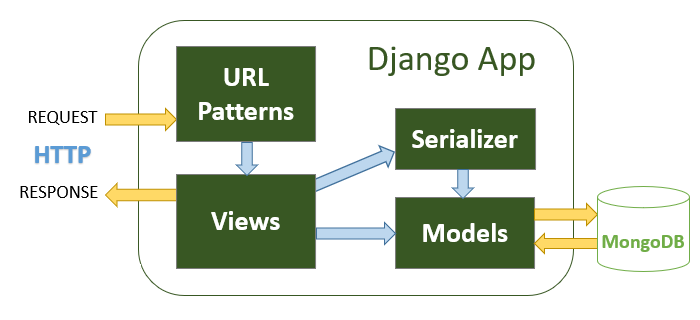
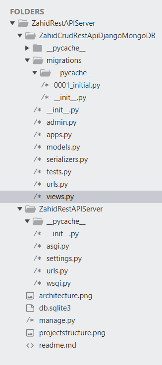

# Mohammed Zahid Wadiwale Assigment for Credence Analytics Internship
## Django Crud Rest API Server | MongoDB | By Mohammed Zahid Wadiwale

### About
This Project is created by Mohammed Zahid I. Wadiwale as a assigment submission for internship at credence analytics. It is a Django based CRUD REST API Server that uses MongoDB as Database Engine. It uses Django Rest Framework for API. Since django dont have inbuild support for MongoDB, hence I have used djongo, a module for Django which transpiles SQLite commands to MongoDB JSON commands. Django by default does not allows cross origin request and therefore I have used django cors headers module.
---
### Demonstration Video
Youtube Link: 
---
### Technology Used

 - MongoDB Community Edition 5.0.9
 - Python 3.10
 - Django | Version: 3.2.8
 - djangorestframework | Version: 3.13.1
 - djongo | Version: 1.3.6
 - django-cors-headers | Version: 3.13.0
---
### Architecture
Here is the Architecture
> 
---
### Project/directory Structure
Here is the Directory Structure
> 
---
### How to Install and RUN
+ Install Python 3.10 make sure you select add to path while installing
+ Then install MongoDB Community Edition 5.0.9 from MongoDB Official Website
+ Then via pip install django | Command: `pip install Django==3.2.8`
+ Then via pip install django rest framework 3.13.1 | Command: `pip install djangorestframework==3.13.1`
+ Then via pip install djongo 1.3.6 | Command `pip install djongo==1.3.6`
+ Then via pip install django cors headers | Command `pip install django-cors-headers==3.13.0`
+ Or instead of installing individual packages you can do `pip install requirements.txt`

> #### Now You have installed all requirements succesfully
> #### RUN Server
>
> - First CD into project directory in powershell or cmd, or just press shift and right click in folder and open powershell/cmd
> - Than run following command `python manage.py runserver 8000` in cmd/powershell
> - Now the server is running, you can now test api, see the below methods table
> - You can use POSTMAN or Any other API testing tool
>
> #### Methods
> Methods | URL's                  | Actions                                   
> ------- | -----------------------| ------------------------------------------
> GET     | api/movies             | get all movies   
> GET     | api/movies/:id         | get movie by `id`   
> POST    | api/movies             | add new movie   
> PUT     | api/movies/:id         | update movie by `id`   
> DELETE  | api/movies/:id         | remove movie by id   
> DELETE  | api/movies             | remove all movies   
> GET     | api/movies?name=[kw]   | find all movie which name contains `'kw'` 
---
### Author
Mohammed Zahid Imtiyaz Wadiwale
---
